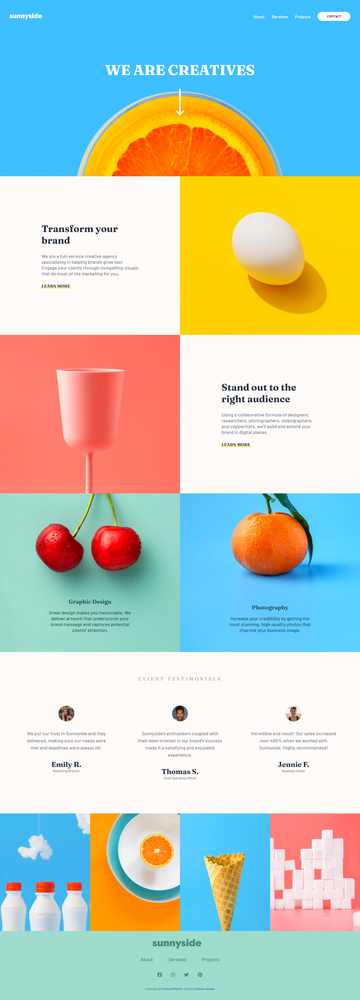

# Sunnyside agency landing page


This is a solution to the [Sunnyside agency landing page challenge on Frontend Mentor](https://www.frontendmentor.io/challenges/sunnyside-agency-landing-page-7yVs3B6ef). Frontend Mentor challenges help you improve your coding skills by building realistic projects.

## Table of contents

- [Overview](#overview)
  - [The challenge](#the-challenge)
  - [Screenshot](#screenshot)
  - [Links](#links)
- [My process](#my-process)
  - [Built with](#built-with)
  - [What I learned](#what-i-learned)
  - [Continued development](#continued-development)
- [Author](#author)


## Overview

### The challenge

Users should be able to:

- View the optimal layout for the section depending on their device's screen size

### Screenshot




### Links

- Solution URL: [github.com/blaqbox-prime/sunnyside-agency-landing-page](https://github.com/blaqbox-prime/sunnyside-agency-landing-page)

- Live Site URL: [Hosted on Github Pages](https://blaqbox-prime.github.io/sunnyside-agency-landing-page/)

## My process
I start off with creating color variables in the document root. Then creating the css classes for text colors and background colors. I then analyze the design and chopped it into sections then split those sections furthur into smaller content containers and start writing the css for those containers as closely as possible to the design. After going as far as I can with the styling I then write the HTML. From there everything is adjusted as the HTML is written.

I use a mobile first aproach so the mobile ui is the initial style then a media query for larger screens, 960px+ is used to create the desktop design. 

### Built with
- Vanilla Javascript
- Semantic HTML5 markup
- CSS custom properties
- Flexbox
- Mobile-first workflow
- CSS grid


### What I learned

The thing I found most challenging about this project was aligning the images and text in the image grids where the background is an image and the text sits on it. getting the text to not clash with parts of the image as the viewport was being resized took a minute to figure out. 

```html
  <article title="Graphic design" id="graphic-design">
            <div class="content">
              <h1>Graphic Design</h1>
          <p>Great design makes you memorable. We deliver artwork that underscores your brand message and captures potential clients’ attention.</p>
          
            </div>
          </article>

        <!-- ------------------------------------------------------- -->
          <article title="Photography" id="photography">
            <div class="content">
              <h1>Photography</h1>
              <p>Increase your credibility by getting the most stunning, high-quality photos that improve your business image.</p>
            </div>
          </article>
```


```css
main #graphic-design {
    width: 100%;
    max-width: 100%;
    position: relative;
    background-color: #9edccd;
    height: 600px;
    margin: 0;
    padding: 0;
    text-align: center;
    background-size: cover;
    background-image: url("../images/desktop/image-graphic-design.jpg");
    color: var(--dark-desaturated-cyan);
    background-position: center;
  }

  main #photography {
    width: 100%;
    max-width: 100%;
    position: relative;
    background-color: #63cdff;
    height: 600px;
    margin: 0;
    padding: 0;
    text-align: center;
    background-position: center;
    background-size: cover;
    background-image: url("../images/desktop/image-photography.jpg");
  }
  article > .content > p {
    margin: 1rem 0;
    max-width: 330px;
  }
```

Although I do think I should have used a container element to limit the sizes of some content. It just tends to look good until a certain width, then everything just looks a little stretched out

## Author

- Instagram - [@ig_blaqbox.dev](https://www.instagram.com/ig_blaqbox.dev)
- Frontend Mentor - [@blaqbox-prime](https://www.frontendmentor.io/profile/blaqbox-prime)
- github - [@blaqbox-prime](https://www.github.com/blaqbox-prime)
